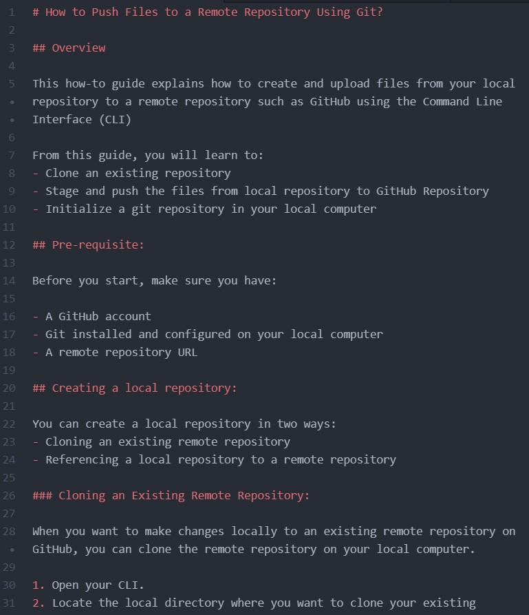

<h1 align="center">Sample 1</h1>
## How to Push Files to a Remote Repository Using Git?

## Overview
I prepared this how-to guide as a sample for my technical writing portfolio.

## Tools Used
GitHub, Git, Atom (text editor), Markdown, Command Line Interface (CLI)

## Documentation Plan

### Audience:
This guide assumes that the user has a little knowledge about how GitHub works- like account creation and knowing where to find the URL of the repository. The user need not necessarily have a strong coding knowledge.

### Benefits:
This guide provides a concise step-by-step approach in learning how to push files from local repository to GitHub using Git and CLI. It also benefits the new developers, technical writers or anyone who wants to have a quick brush up about committing and pushing files from the local repository.

### Results:
For writing a clear how-to guide, I tested the process and the sequence before preparing the document. With the help of Atom, I created the document in Markdown syntax locally on the computer. Then, I used the steps mentioned in the document, to stage, commit and push the changes to the GitHub repository. Additionally, I also documented some of the errors the first-time users might face when following the process, with its proposed solution.

